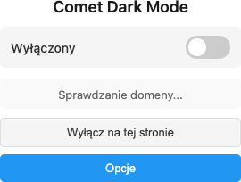
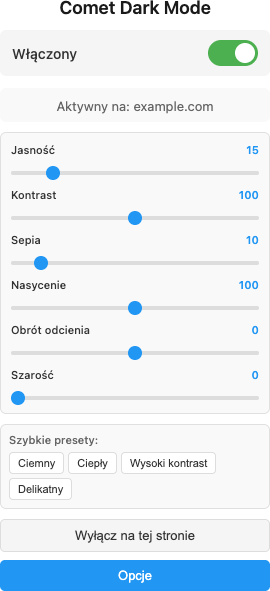
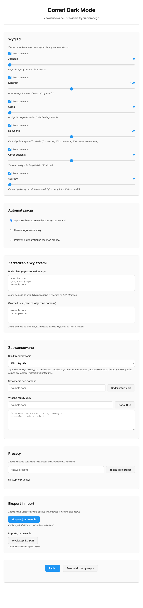

Nie każda strona ma tryb ciemny. A oczy męczą się niezależnie od tego, czy
akurat trafiłeś na nowoczesny serwis, czy na forum sprzed dekady świecące
bielą. **Comet Dark Mode** to lekka wtyczka do przeglądarki, która wymusza
tryb ciemny **wszędzie** — z inteligentną inwersją kolorów, która nie psuje
zdjęć ani filmów.

Bez kont, bez chmury, bez zbierania danych. Wszystko działa lokalnie w Twojej
przeglądarce.

---

## Jak to działa w praktyce

Cała codzienna obsługa mieści się w jednym przycisku na pasku narzędzi. Klikasz
ikonę — otwiera się panel z przełącznikiem i suwakami.

**Stan wyłączony — jeden przełącznik:**

**Stan włączony — suwaki i presety pod ręką:**

Po włączeniu masz od razu dostęp do sześciu regulacji i szybkich presetów.
Wtyczka pokazuje też, na której domenie właśnie działa.

---

## Najważniejsze funkcje

### 🌓 Globalny przełącznik
Jedno kliknięcie (lub skrót klawiszowy) włącza tryb ciemny na dowolnej stronie.
Kolory tekstu i tła zostają odwrócone, ale **zdjęcia, wideo, ikony i ramki
iframe zachowują oryginalny wygląd** — bez efektu „negatywu".

### 🎚️ Sześć regulacji wyglądu
Dopasuj tryb ciemny do siebie:

- **Jasność** — jak ciemne ma być tło
- **Kontrast** — czytelność tekstu
- **Sepia** — cieplejszy ton, mniej niebieskiego światła
- **Nasycenie** — intensywność kolorów
- **Obrót odcienia** — zmiana całej palety
- **Szarość** — od pełnego koloru po odcienie szarości

Każdy suwak możesz ukryć lub pokazać w panelu — trzymasz pod ręką tylko to,
czego naprawdę używasz.

### 🕑 Automatyzacja
Nie chcesz przełączać ręcznie? Wtyczka zrobi to za Ciebie na trzy sposoby:

- **Synchronizacja z systemem** — podąża za trybem ciemnym Windows / macOS / Linux
- **Harmonogram** — np. ciemno od 20:00 do 8:00
- **Zachód słońca** — na podstawie Twojej lokalizacji geograficznej

### 🌐 Wykrywanie natywnego trybu ciemnego
Jeśli strona **już jest ciemna** (np. GitHub), Comet to rozpozna i nie będzie
niczego zmieniać — zamiast tego pokaże dyskretne powiadomienie. Koniec z
podwójną inwersją i dziwnie wyglądającymi serwisami.

### ✅ Białe i czarne listy
Pełna kontrola nad wyjątkami:

- **Biała lista** — domeny, na których wtyczka jest **zawsze wyłączona**
- **Czarna lista** — domeny, na których jest **zawsze włączona**

Możesz też zapisać **osobne ustawienia dla konkretnej domeny** albo wstrzyknąć
własne reguły CSS.

### ⭐ Presety
Zapisz ulubioną konfigurację jako preset i przełączaj się jednym kliknięciem.
W zestawie są gotowce: **Ciemny, Ciepły, Wysoki kontrast, Delikatny**.

### 💾 Eksport i import
Wszystkie ustawienia zapiszesz do pliku JSON — jako backup albo żeby przenieść
je na inny komputer.

---

## Pełny panel ustawień

Zaawansowane opcje kryją się na osobnej stronie — od regulacji, przez
automatyzację i listy wyjątków, po presety oraz eksport/import:

---

## Dwa silniki renderowania

W ustawieniach zaawansowanych wybierzesz sposób działania:

- **Filtr (Szybki)** — stosuje inwersję kolorów na całej stronie. Błyskawiczny,
  minimalny narzut, sprawdza się na zdecydowanej większości stron.
- **Analiza** — daje obecnie ten sam efekt co „Filtr", dodatkowo cache'uje
  wygenerowany CSS dla danego adresu.

W praktyce **domyślny tryb „Filtr" jest tym, którego potrzebujesz.**

---

## Skrót klawiszowy

Najszybszy sposób na przełączenie trybu ciemnego:

- **Windows / Linux:** `Ctrl + Shift + D`
- **macOS:** `Cmd + Shift + D`

---

## Instalacja

Wtyczka działa w Chrome, Edge i Firefoksie.

**Chrome / Edge:**
1. Wejdź na `chrome://extensions/` (lub `edge://extensions/`)
2. Włącz **Tryb deweloperski**
3. Kliknij **Załaduj rozpakowane** i wskaż folder z wtyczką

**Firefox:**
1. Wejdź na `about:debugging` → **Ten komputer**
2. **Załaduj tymczasowe rozszerzenie** i wybierz plik `manifest.json`

---

## Dla technicznych

- **Manifest V3** (Chrome/Edge), zgodność z Firefoksem
- Czysty **JavaScript (ES6+)**, HTML5, CSS3 — **zero zewnętrznych zależności**
- Brak systemu buildu — kod ładuje się bezpośrednio
- Działa **w pełni offline** — żadnych zewnętrznych API ani wysyłania danych
- Ustawienia synchronizowane przez `chrome.storage.sync` (z fallbackiem lokalnym)

---

## Podsumowanie

Comet Dark Mode robi jedną rzecz i robi ją dobrze: **daje Ci ciemny, wygodny
dla oczu internet — na każdej stronie, na Twoich warunkach.** Lekki, prywatny,
konfigurowalny dokładnie tyle, ile chcesz.

*Ciemniej. Cieplej. Spokojniej dla oczu.* 🌙
